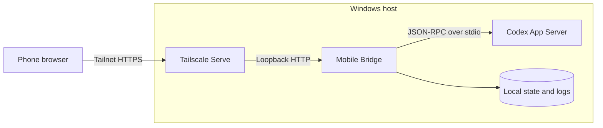

English | [简体中文](./README.zh-CN.md)

<p align="center">
  
</p>

<h1 align="center">Codex Mobile Bridge</h1>

<p align="center">
  A self-hosted web interface for accessing local Codex conversations from a phone.<br>
  Runs on the Windows loopback interface and stays private through Tailscale Serve.<br>
  Built for people like me whose ChatGPT Desktop app does not show Remote/Connections.
</p>

<p align="center">
  <a href="https://nodejs.org/"></a>
  <a href="https://www.microsoft.com/windows/"></a>
  <a href="https://tailscale.com/"></a>
  <a href="./LICENSE"></a>
</p>

## Interface preview

> [!NOTE]
> Every conversation, path, metric, and result shown below is fictional demo
> data created for documentation. No personal or production information is
> included.

<p align="center"><strong>Desktop · Light</strong><br>
  
</p>

<p align="center"><strong>Desktop · Dark</strong><br>
  
</p>

<p align="center"><strong>Mobile · Light</strong><br>
  
</p>

<p align="center"><strong>Mobile · Dark</strong><br>
  
</p>

## Features

- Search, open, and create Codex conversations.
- Render responses with Markdown, clickable links, tables, and code blocks.
- Send messages, queue follow-ups without interrupting active work, stop turns
  explicitly, and handle supported approval and user-input requests.
- Persist mobile follow-ups locally and retry them automatically after another
  Codex client releases the conversation.
- Stream responses over SSE with heartbeats, bounded replay, and incremental
  synchronization after reconnecting.
- Load the latest 10 turns first and fetch large tool details only when opened.
- Install as a PWA with safe-area layout and a new-conversation shortcut.
- Keep the static interface available offline and activate frontend updates on
  the next launch after all app windows close.
- Recover through a scheduled watchdog and support verified blue-green restarts.
- Switch between dark and light themes, and between English and Simplified Chinese.
- Run without runtime npm dependencies.

## Requirements

- Windows 10 or 11
- PowerShell 5.1 or newer
- Node.js 20 or newer
- Codex CLI installed and signed in
- Tailscale installed, signed in, and connected

## Installation

Run the setup script from the project directory:

```powershell
.\setup.ps1
```

The script validates dependencies, selects available ports, creates the local
configuration, starts the bridge, configures Tailscale Serve, and installs the
per-user watchdog.

Preview the operation without changing the machine:

```powershell
.\setup.ps1 -WhatIf
```

To select ports or the initial interface language explicitly:

```powershell
.\setup.ps1 -LocalPort 8765 -HttpsPort 8443 -Language zh-CN
```

After setup completes, open the printed HTTPS URL on a phone connected to the
same tailnet.

### Install as an app

- On Chromium browsers, use **Install app** from the browser menu or address bar.
- On iPhone or iPad, open the browser's **Share** menu and choose
  **Add to Home Screen**.
- Once installed, supported launchers expose a **New conversation** shortcut.

The cached app shell can open without a network connection, but conversations,
status, and every mutation still require the tailnet and are never stored in the
service-worker cache. New frontend versions wait until all browser tabs or app
windows close, then activate on the next launch without an in-app prompt.

## Architecture



Only Tailscale Serve is remotely reachable. API responses and conversation data
use `no-store`; the service worker caches static UI files only. Navigation uses
a short network-first window and falls back to that shell on slow or lost links.

## Operations

| Command | Description |
| --- | --- |
| `.\start.ps1` | Start the bridge or verify the existing process. |
| `.\status.ps1` | Show bridge, App Server, listener, Serve, and watchdog status. |
| `.\bluegreen-restart.ps1` | Verify a candidate instance before switching traffic. |
| `.\restart.ps1` | Stop and start the bridge. |
| `.\stop.ps1` | Stop the bridge and disable its Serve rule. |
| `.\install-watchdog.ps1` | Install or update automatic recovery. |
| `.\uninstall-watchdog.ps1` | Remove automatic recovery. |

Use `bluegreen-restart.ps1` for a planned upgrade while the bridge is healthy
and idle. By default, it refuses to switch while a turn is active.

## Configuration

Machine-specific paths, ports, language, and the generated URL are stored in
the Git-ignored `state/config.json`. Configuration priority is:

1. environment variables;
2. `state/config.json`;
3. automatic discovery and defaults.

<details>
<summary>Environment variables</summary>

| Variable | Default | Description |
| --- | --- | --- |
| `BRIDGE_PORT` | first free port from `8765` | Loopback HTTP port |
| `BRIDGE_HTTPS_PORT` | first free port from `8443` | Tailscale Serve HTTPS port |
| `BRIDGE_NODE_PATH` | discovered | Node.js executable |
| `BRIDGE_CODEX_COMMAND` | discovered | Codex CLI executable |
| `BRIDGE_TAILSCALE_PATH` | discovered | Tailscale executable |
| `BRIDGE_UI_LANGUAGE` | OS language | `en` or `zh-CN` |
| `BRIDGE_APPROVAL_POLICY` | `never` | App Server approval policy |
| `BRIDGE_SANDBOX_MODE` | `danger-full-access` | Codex sandbox mode |

The Node entrypoint also accepts `CODEX_COMMAND`, `CODEX_ARGS_JSON`,
`CODEX_CWD`, `BRIDGE_STATE_FILE`, and `BRIDGE_MAX_BODY_BYTES`. A non-loopback
bind requires `BRIDGE_ALLOW_NON_LOOPBACK=1`.

</details>

## Security

The default execution mode is `danger-full-access` with approval policy `never`.
Any tailnet device allowed to open the bridge can ask Codex to execute commands
or modify files on the host. Review tailnet membership and ACLs before use. Do
not expose the bridge directly to the public internet.

Browser mutations require JSON and reject cross-site browser requests. Static
responses include a restrictive Content Security Policy.

## Development

Run syntax checks, unit tests, and the protocol fixture integration test:

```powershell
npm run check
```

Automated tests cover local HTTP behavior and protocol mapping. Installed Codex
CLI compatibility, the production process, Tailscale Serve, watchdog scheduling,
and access from a separate phone remain separate verification steps.

For implementation details and release history, see
[ARCHITECTURE.md](./ARCHITECTURE.md) and [CHANGELOG.md](./CHANGELOG.md).

## License

[MIT](./LICENSE)
