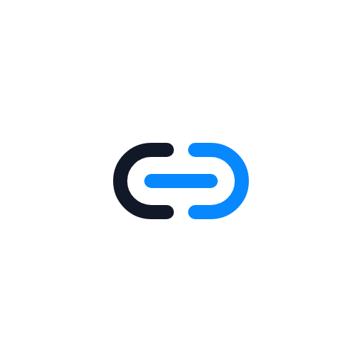
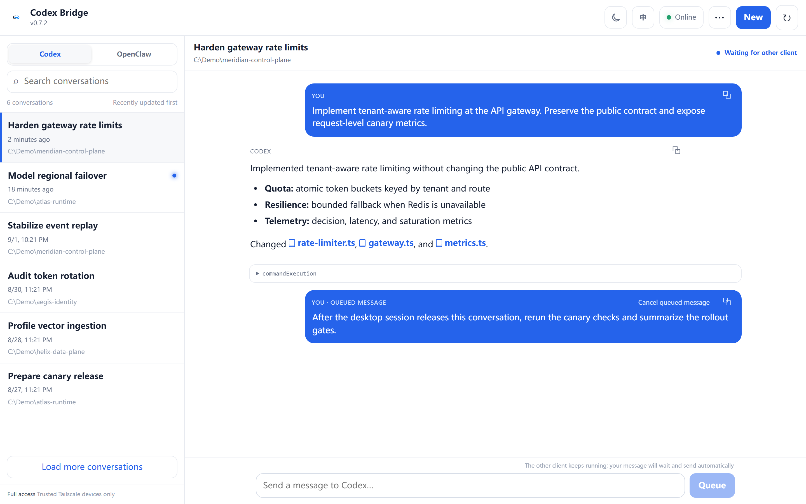
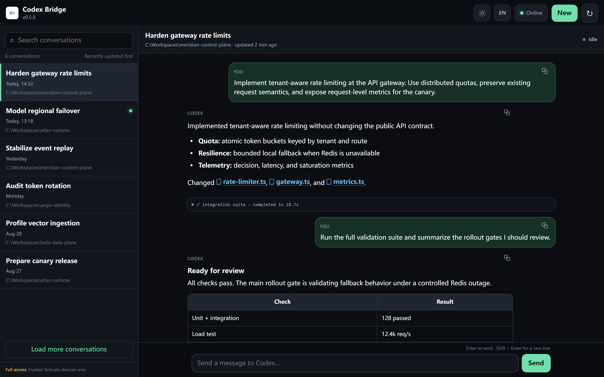
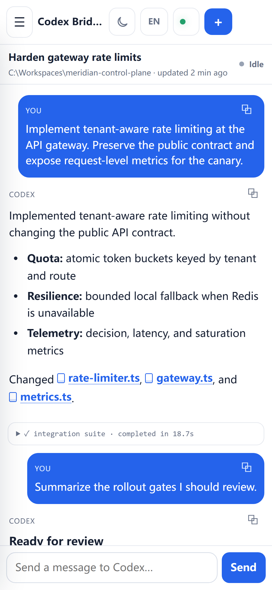
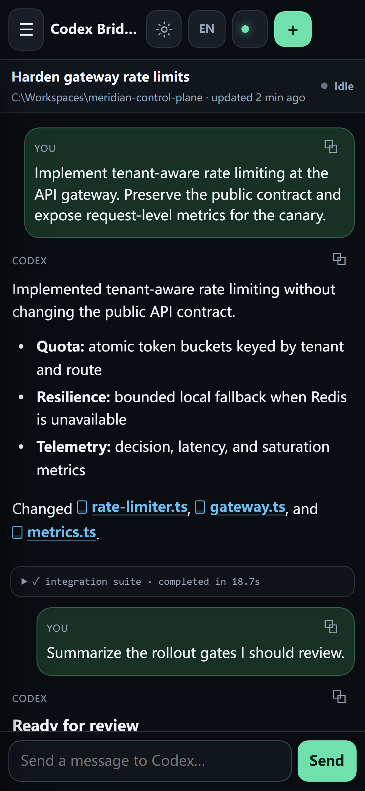
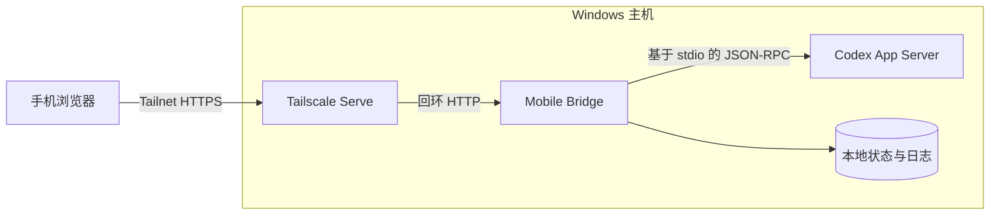

[English](./README.md) | 简体中文

<p align="center">
  
</p>

<h1 align="center">Codex Mobile Bridge</h1>

<p align="center">
  一个通过手机访问本地 Codex 会话的自托管 Web 界面。<br>
  服务运行在 Windows 回环地址上，并通过 Tailscale Serve 保持私有访问。<br>
  这个项目是为像我一样在 ChatGPT Desktop 中看不到“远程/连接”入口的人准备的。<br>
  手机不需要直接访问 ChatGPT 服务，也不必为 ChatGPT 另开代理或 VPN；
  只需连接同一个 Tailscale tailnet。
</p>

<p align="center">
  <a href="https://github.com/ltspace/codex-mobile-bridge/actions/workflows/ci.yml"></a>
  <a href="https://nodejs.org/"></a>
  <a href="https://www.microsoft.com/windows/"></a>
  <a href="https://tailscale.com/"></a>
  <a href="./LICENSE"></a>
</p>

## 快速开始

```powershell
git clone https://github.com/ltspace/codex-mobile-bridge.git
cd codex-mobile-bridge
.\setup.ps1
```

安装脚本会检查本机环境、启动仅监听回环地址的 Bridge、配置 Tailscale
Serve，并输出供手机打开的私有 HTTPS 地址。

> [!IMPORTANT]
> Bridge 会让获准访问的 tailnet 设备通过 Codex 在主机上执行命令。分享访问
> 地址前，请先检查 tailnet 成员和 ACL。

## 界面预览

> [!NOTE]
> 下方出现的会话、路径、指标和结果均为专门制作的虚构演示数据，不包含
> 任何个人信息或生产数据。

<p align="center"><strong>桌面端 · 白色</strong><br>
  
</p>

<p align="center"><strong>桌面端 · 深色</strong><br>
  
</p>

<p align="center"><strong>手机端 · 白色</strong><br>
  
</p>

<p align="center"><strong>手机端 · 深色</strong><br>
  
</p>

## 功能

- 在 Codex 和 OpenClaw 会话列表间切换（默认 Codex），可搜索和打开两类会话，
  或新建 Codex 会话。
- 从顶栏“更多操作”菜单归档当前空闲会话。
- 使用短生命周期的独立 App Server 执行归档，较慢的递归归档不会阻塞主会话通道。
- 使用 Markdown 渲染回复，并支持可点击链接、表格和代码块。
- 发送消息、在不中断活动任务的情况下排队后续消息、显式停止任务，并处理支持的审批和用户输入请求。
- 在本机持久化移动端待发消息；其他 Codex 客户端释放会话后自动重试。
- 排队消息被电脑端阻塞时，可在二次确认后显式接管。Bridge 会在 Windows
  上反查准确持锁者，只停止已验证且仅持有这一条空闲会话的 VS Code Codex
  App Server；活动会话、同时持有其他会话的 writer、Bridge 自身、OpenClaw
  或归属不明的进程都会被拒绝。
- 通过 SSE 实时接收回复，支持心跳、有限事件重放和重连后的增量同步。
- 通过 App Server 状态数据库读取会话列表；RPC 超时后进入有限恢复等待，避免
  手机端重复刷新继续堆积慢请求。
- 首次加载最近 10 轮，大型工具详情只在打开时获取。
- 可安装成 PWA，提供安全区域适配和“新建会话”快捷方式。
- 离线时仍可打开静态界面；所有应用窗口关闭后，新版本会在下次启动时接管。
- 通过计划任务 watchdog 自动恢复，并支持经过验证的蓝绿重启。
- 在深色和白色主题之间切换，也可切换英文和简体中文界面。
- 没有运行时 npm 依赖。

## 环境要求

- Windows 10 或 11
- PowerShell 5.1 或更高版本
- Node.js 20 或更高版本
- 已安装并登录 Codex CLI
- 已安装、登录并连接 Tailscale

## 安装

在项目目录运行安装脚本：

```powershell
.\setup.ps1
```

脚本会检查依赖、选择可用端口、创建本机配置、启动 Bridge、配置
Tailscale Serve，并安装当前用户的 watchdog 计划任务。

只预览操作，不修改电脑：

```powershell
.\setup.ps1 -WhatIf
```

显式指定端口或初始界面语言：

```powershell
.\setup.ps1 -LocalPort 8765 -HttpsPort 8443 -Language zh-CN
```

安装完成后，在已连接同一 tailnet 的手机上打开脚本输出的 HTTPS 地址。

### 安装成应用

- Chromium 浏览器请从浏览器菜单或地址栏选择“安装应用”。
- iPhone 或 iPad 请打开浏览器的“分享”菜单，再选择“添加到主屏幕”。
- 安装后，支持该能力的启动器会提供“新建会话”快捷方式。

缓存的应用外壳可在没有网络时打开，但会话、状态和所有写操作仍然必须连接
tailnet，并且绝不会写入 Service Worker 缓存。当前端新版本就绪时，它会等到
所有浏览器标签页或应用窗口关闭，再在下次启动时接管，不显示应用内提示。

## 架构



只有 Tailscale Serve 可以被远程访问。API 响应和会话数据使用 `no-store`；
Service Worker 只缓存静态界面文件。页面导航会先给网络一个很短的响应窗口，
弱网或断网时再回退到静态外壳。

## 日常操作

| 命令 | 说明 |
| --- | --- |
| `.\start.ps1` | 启动 Bridge，或检查现有进程。 |
| `.\status.ps1` | 查看 Bridge、App Server、监听端口、Serve 和 watchdog 状态。 |
| `.\bluegreen-restart.ps1` | 验证候选实例后再切换流量。 |
| `.\restart.ps1` | 停止并重新启动 Bridge。 |
| `.\stop.ps1` | 停止 Bridge 并关闭对应的 Serve 规则。 |
| `.\install-watchdog.ps1` | 安装或更新自动恢复任务。 |
| `.\uninstall-watchdog.ps1` | 删除自动恢复任务。 |

安装 watchdog 时会请求一次管理员确认，以便任务计划程序使用当前用户的
非交互式 S4U 令牌执行分钟级检查。它不会保存密码，也不会反复弹出控制台窗口。

Bridge 健康且没有任务运行时，计划升级建议使用
`bluegreen-restart.ps1`。存在活动任务时，该脚本默认拒绝切换。

## 配置

本机路径、端口、语言和生成的访问地址保存在 Git 忽略的
`state/config.json` 中。配置优先级为：

1. 环境变量；
2. `state/config.json`；
3. 自动发现和默认值。

<details>
<summary>环境变量</summary>

| 变量 | 默认值 | 说明 |
| --- | --- | --- |
| `BRIDGE_PORT` | 从 `8765` 起首个空闲端口 | 回环 HTTP 端口 |
| `BRIDGE_HTTPS_PORT` | 从 `8443` 起首个空闲端口 | Tailscale Serve HTTPS 端口 |
| `BRIDGE_NODE_PATH` | 自动发现 | Node.js 可执行文件 |
| `BRIDGE_CODEX_COMMAND` | 自动发现 | Codex CLI 可执行文件 |
| `BRIDGE_TAILSCALE_PATH` | 自动发现 | Tailscale 可执行文件 |
| `BRIDGE_UI_LANGUAGE` | 操作系统语言 | `en` 或 `zh-CN` |
| `BRIDGE_APPROVAL_POLICY` | `never` | App Server 审批策略 |
| `BRIDGE_SANDBOX_MODE` | `danger-full-access` | Codex 沙箱模式 |

Node 入口还支持 `CODEX_COMMAND`、`CODEX_ARGS_JSON`、`CODEX_CWD`、
`BRIDGE_STATE_FILE` 和 `BRIDGE_MAX_BODY_BYTES`。绑定非回环地址需要设置
`BRIDGE_ALLOW_NON_LOOPBACK=1`。

</details>

## 安全说明

默认执行模式为 `danger-full-access`，审批策略为 `never`。任何有权打开
Bridge 的 tailnet 设备都能要求 Codex 在主机上执行命令或修改文件。使用前
请检查 tailnet 成员和 ACL。不要把 Bridge 直接暴露到公网。

浏览器写操作必须使用 JSON，并拒绝跨站浏览器请求。静态响应包含严格的
Content Security Policy。

## 开发与验证

运行语法检查、单元测试和协议夹具集成测试：

```powershell
npm run check
```

自动化测试覆盖本地 HTTP 行为和协议映射。已安装 Codex CLI 的兼容性、生产
进程、Tailscale Serve、watchdog 调度和另一台手机的访问仍是独立验证项。

实现细节和版本记录见 [ARCHITECTURE.md](./ARCHITECTURE.md) 和
[CHANGELOG.md](./CHANGELOG.md)。欢迎参与改进；提交 Issue 或 Pull Request 前，
请先阅读 [CONTRIBUTING.md](./CONTRIBUTING.md)。

## 许可证

[MIT](./LICENSE)
